# Put Sonar on Linux Locally

## Tools & Getting a local environment for Sonarqube:

Assuming you have admin on the machine and it's a personal or something intended for development.

You'll need some tools:
 1. a text editor (notepad++, visual studio code, vim, sublime text, etc.)
 2. a way to setup local servers (virtual box is free-99)
 3. 

Since we are heading towards using Sonarqube in linux, you'll want a linux environment. Virtualbox is a good way to get that stood up on Windows/Mac. There are other ways (WSL, cygwin, mingw, parallels, dual booting a personal machine) but Virtualbox should work on your machine and is easily changed-destroyed-rebuilt without taking much time. (Docker is good too, but that's for later)

### preparation steps
1. make a folder in your Documents (or wherever) called "Sonar Local"
    * this will be the "catch-all" folder for this project.

### Setting up a VirtualBox Ubuntu

You can get virtual box from https://www.virtualbox.org/wiki/Downloads
1. Under the "platform packages" section, you'll need the "Windows Hosts" or "OS X Hosts" depending on your operating system
    * I'll be using windows for mine, but if you're on a mac it should be close enough to follow along. If it's not, we can make this document better.
1. This should prompt you to save the file. Put it in your local sonar folder and once it is done downloading, run it.
1. Just do the default install options. Once it's installed you'll see something like this
    * 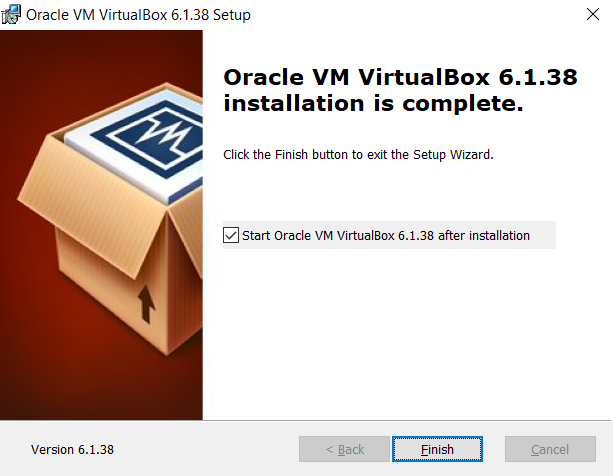
1. Now you'll need a linux image. I'm going to use Ubuntu LTS for this guide. You can get it from [Ubuntu's downloads page](https://ubuntu.com/download/desktop).
1. Once that is downloaded, start VirtualBox and go to Machine>New. Give your machine 8Gb(8192mb) memory and name it Ubuntu LTS. It should match the screen below.
    * 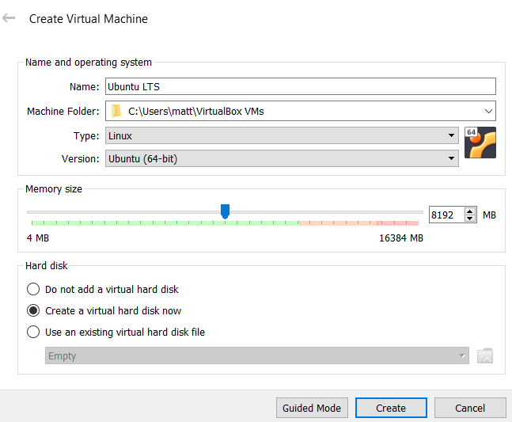
1. Now you'll create the hard disk. I'm going with 40GB, but we may not need this much for Sonar and our toolchain. It should match the screen below.
    * 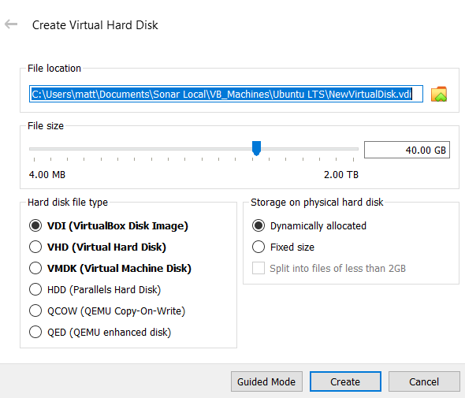
1. Now click "Start" in VirtualBox Manager. You should get prompted to select an image to boot, but if not...
    1. go to "Devices">"Optical Drives">"Choose a disk file..."
        * 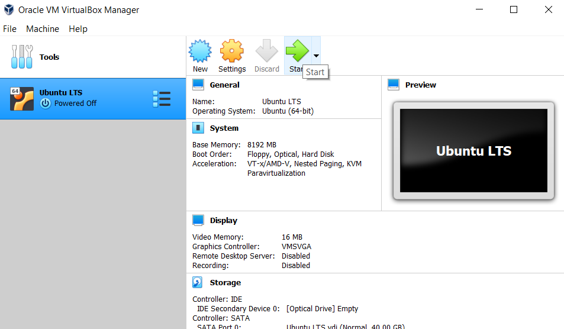
        * 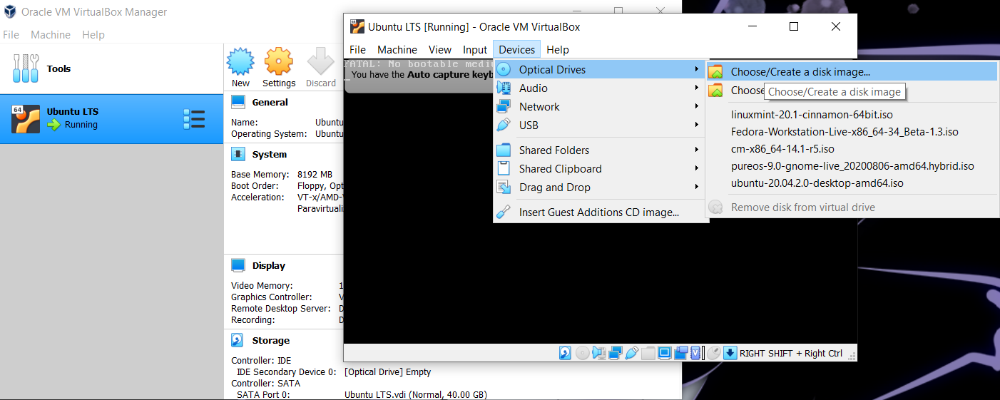
    1. Use the "Add" button and select your Ubuntu LTS iso file from earlier.
        * 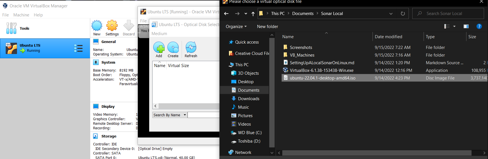
    1. You may need to reset the machine. Use "Machine">"Reset.
        * 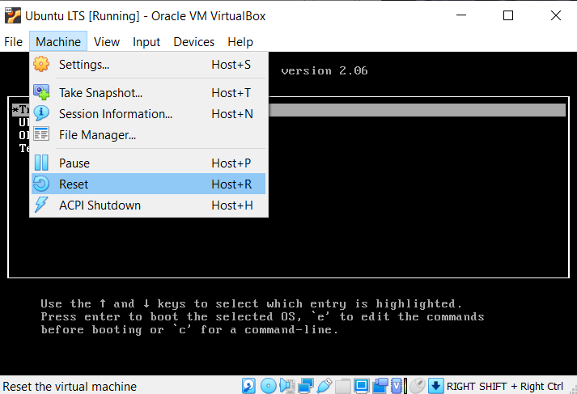
1. When it restarts, you should see the screen below. Use the arrow keys to select "*Try or Install Ubuntu" and press Enter.
    * 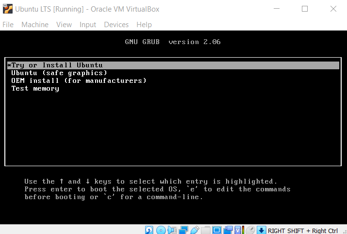
    * I *really* don't want to do a full How-To on installing Ubuntu because they've got a great one and why re-invent the wheel? Having said that, here are some notes/suggestions.
        * minimal installation will be more than enough for what we're going to do
            * 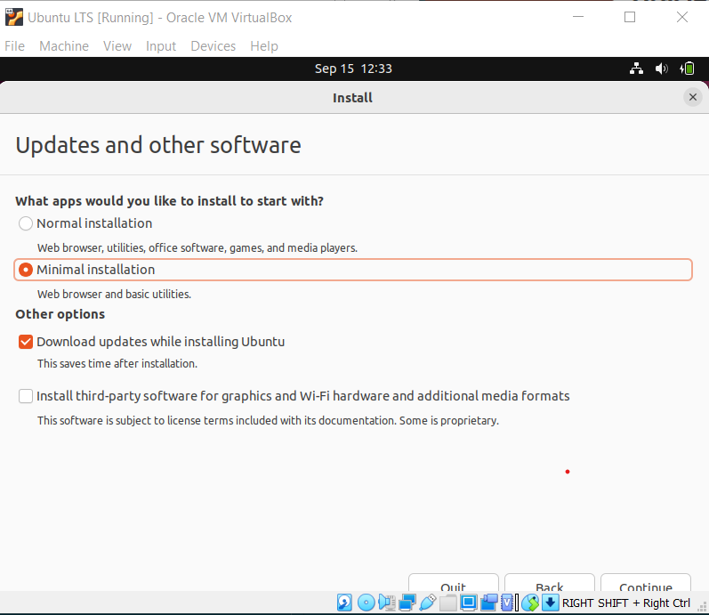
        * These 2 screens look scary, but Erase the disk (the virtual 40Gb one we just made) and hit "Continue" on the confirmation.
            * 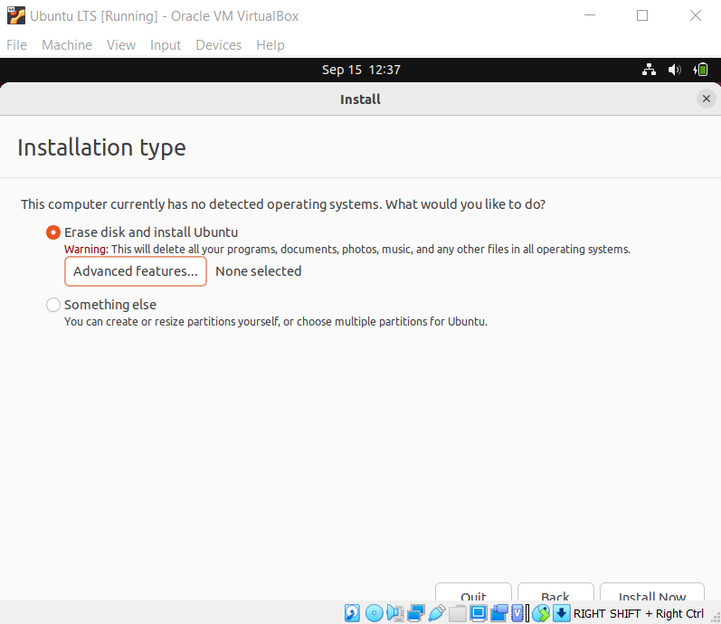
            * 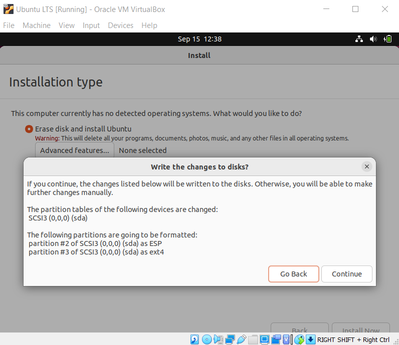
1. Now just go through the setup for Ubuntu and install the updates. You should default to "No" when it's asking about anonymous data or location or tracking or any of that stuff. :) (draw the rest of the owl jokes incoming)

### getting linux ready for dev work

Good news, we're on ubuntu and everything you need to know is already in a forum somewhere or documented by the Ubuntu team.
Bad news, our Ubuntu from above needs some stuff to be ready for everything we'll need to do.
Good news (abounds), getting stuff on linux is SUPER **EASY** because you just get it from the package manager.

#### installing git (detailed)

apt is a good way to get everything you need, including this document (hint hint).

1. open a terminal in ubuntu (press the windows/super key and start typing terminal)
1. congratulations, that's the most valuable trick in this whole section.
1. type `sudo apt install git -y` 
    * 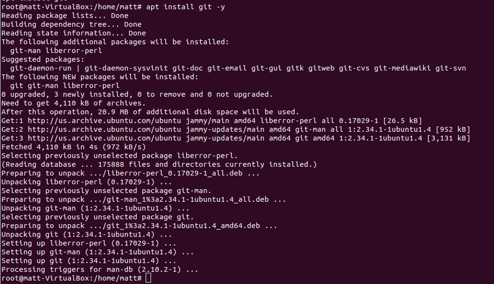
1. now type `git --version`
    * 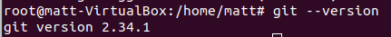

Now let's get the repo containing this document with the git install we've just completed.

type the following steps:
* `$cd /home/<yourusername>/Documents`
* `$mkdir 'Sonar Local'`
* `$cd Sonar\ Local/`
* `$git clone https://github.com/mtthwmths/SonarVBLocal`
* `$cd SonarVBLocal'
* '$vim SettingUpALocalSonarOnLinux.md'

You're now staring at this document in your terminal's text editor 'Vim'.

#### other tools

I'm just gonna rattle off the stuff I'm using below here with any weird steps if they come up.
You should be able to just type `$apt install <packagename>` to get everything on this list.

* python3

### getting Sonar on the Ubuntu machine 0_0

Nike, Just do it! 

Just kidding, let's outline some steps. For this section, I will be working in my Ubuntu VirtualBox machine. If you went with a cooler solution, then these should still work but you'll need to adjust for other package management or hardware/software configurations. 

## random links and notes
* [SecureCRT](https://www.vandyke.com/products/securecrt/index.html)
* [putty](https://www.chiark.greenend.org.uk/~sgtatham/putty/latest.html)
* [VirtualBox](https://www.virtualbox.org/wiki/Downloads)
* [VS Code markdown doc](https://code.visualstudio.com/Docs/languages/markdown)
* [sqlserver2pgsql](https://github.com/dalibo/sqlserver2pgsql)
* [migrating sqlserver to postgres article](https://www.endpointdev.com/blog/2019/01/migrate-from-sql-server-to-postgresql/)
